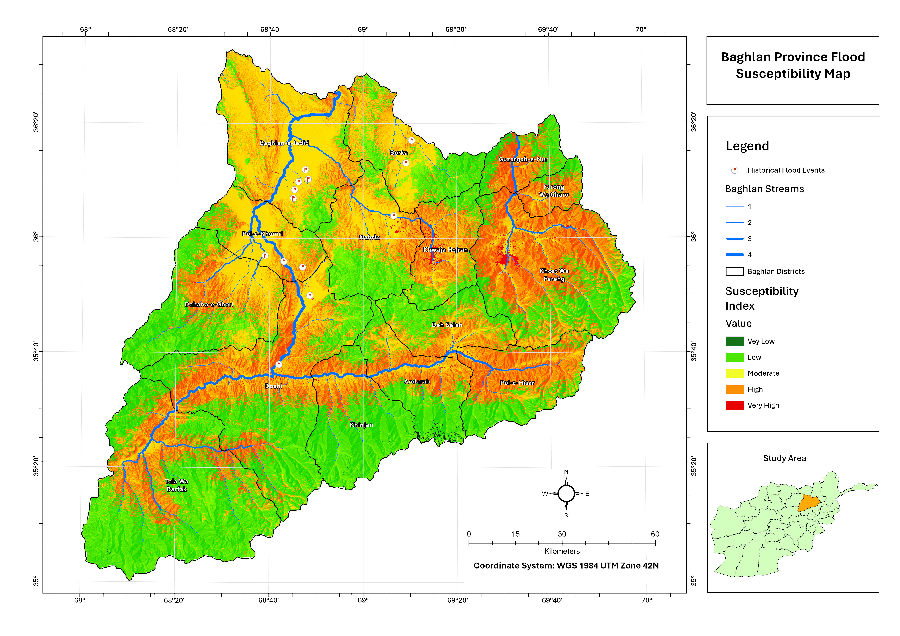
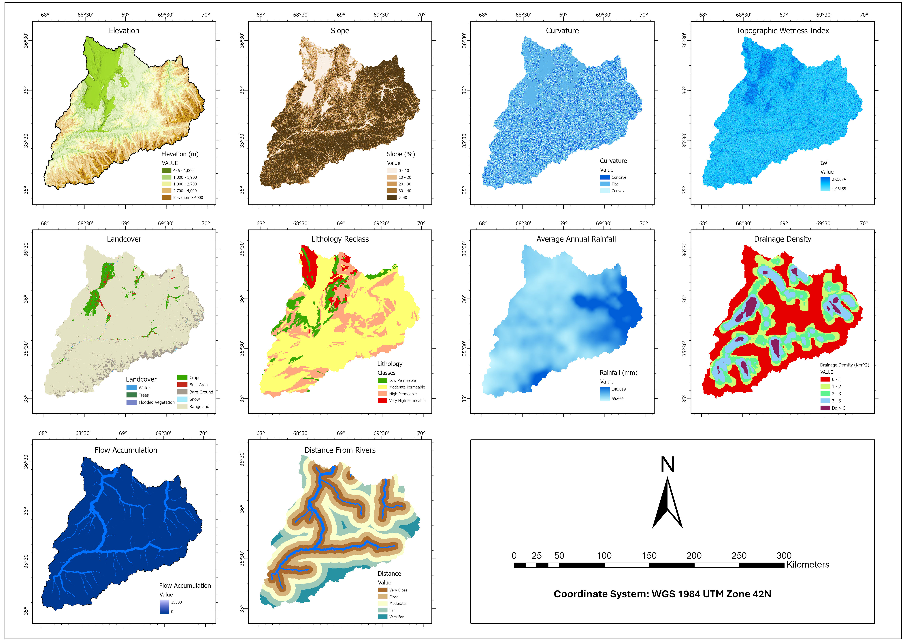

# Flood Susceptibility Mapping – Baghlan Province, Afghanistan

GIS-based flood susceptibility assessment for Baghlan Province 

## Overview

Baghlan lies in north-eastern Afghanistan, spanning the Hindu Kush foothills and the Baghlan–Kunduz river plain. Flash and riverine floods repeatedly affect settlements and farmland along its river network. This project maps where flooding is most likely, to support land-use planning and risk reduction.

- **Study area:** Baghlan Province (14 districts)
- **Output:** Susceptibility index in five classes: Very Low, Low, Moderate, High, Very High
- **Coordinate system:** WGS 1984 UTM Zone 42N
- **Tools:** [ArcGIS Pro]

## Key findings

- High and Very High susceptibility concentrate along the main river corridors and the low-lying plains of the north-west (Baghlan-e-Jadid, Pul-e-Khumri), where most recorded flood events fall.
- Very High pockets appear around Khwaja Hejran and Khost Wa Fereng, where steep terrain drains into narrow valleys.
- The high-elevation, rangeland-dominated south is mostly Low Susceptible.

## Conditioning factors

| Factor | Why it matters | Source |
|---|---|---|
| Elevation | Low ground collects runoff; range 436–5,399 m | DEM source: NASA SRTM 30m DEM, resolution: 30m |
| Slope | Steep slopes speed runoff; flat areas pond water | Derived from DEM |
| Curvature | Concave areas concentrate flow | Derived from DEM |
| Topographic Wetness Index (TWI) | Tendency of water to accumulate | Derived from DEM |
| Land cover | Surface roughness and infiltration (rangeland, crops, built area, bare ground, etc.) | Dataset: ESRI 10m Landcover |
| Lithology (reclassified) | Permeability class controls infiltration | Geological map source: Afghan Geological Survey Department |
| Average annual rainfall | Main driver of runoff volume | [NASA Earthdata] |
| Drainage density | Dense networks drain faster | Derived from stream network |
| Flow accumulation | Identifies concentrated flow paths | Derived from DEM |
| Distance from rivers | Proximity to channels raises exposure | Derived from stream network |

## Methodology

1. Prepare and clip all layers to the province boundary; resample to a common resolution (30m) and projection.
2. Derive terrain factors (slope, curvature, TWI, flow accumulation, drainage density) from the DEM.
3. Reclassify each factor into susceptibility classes.
4. Weight and combine the factors using AHP model.
5. Classify the final index into five classes.
6. Validate against historical flood events using Local Reports.

## Validation

Historical flood records are concentrated in the north-west plains (Baghlan-e-Jadid, Pul-e-Khumri), where population and infrastructure are dense. Khwaja Hejran and Khost Wa Fereng are mapped as Very High susceptibility because of their steep terrain and convergent drainage, but they are sparsely populated, so floods there are rarely recorded. The lack of recorded events in these districts therefore reflects reporting bias, not low flood likelihood. Validation is strongest in well-documented areas.

## Limitations

- Results depend on input data resolution and quality, especially rainfall and lithology.
- Historical flood points are limited and clustered, so validation is strongest in the north-west.
- This is a susceptibility map, not a hazard or risk map; it does not model flood depth, return period or exposure.

## Author

**Hamayon Muradi** – GIS & Remote Sensing | Kabul, Afghanistan
Email: hamayonmuradi8@gmail.com 
